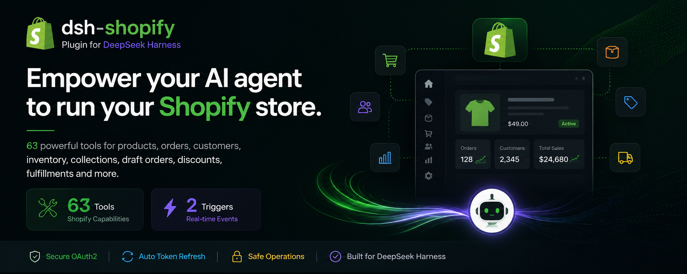

# dsh-shopify · Shopify Plugin for DeepSeek Harness



[](https://opensource.org/licenses/MIT)

A complete, production-ready **Shopify plugin for [DeepSeek Harness](https://github.com/deepseek-ai/deepseek-harness) (DSH)**. It gives the agent typed, policy-aware access to the Shopify **Admin REST + GraphQL APIs** — **210+ model-facing tools** covering products, orders, customers, collections, inventory, fulfillments, discounts, content, metafields, webhooks, themes, draft orders, marketing, gift cards, billing, bulk operations, and a generic GraphQL escape hatch — with Admin API access-token auth resolved through DSH's credential service.

> **Official ecosystem keyword:** this is a `dsh-plugin` — add the `dsh-plugin` GitHub topic to this repository.

> **Where this came from:** the tool surface is distilled from the Composio `SHOPIFY` integration (407 actions). Most of those 407 are deprecated duplicates and legacy REST aliases; this plugin keeps the **current, non-deprecated operation per capability** and adds the GraphQL-first surfaces (new product model, write presets, bulk operations), so ~213 tools cover the same workflows with one canonical tool per job.

---

## 🤖 LLM-readable summary

- **What:** a single Cordis plugin that extends DSH agents with 210+ `shopify_*` tools over the Shopify Admin API.
- **Install:** `dsh plugin --profile web add github:sakthiveltofficial/dsh-shopify-plugins`, then add one row to your profile patch (or agent preset) — see [Install](#-install).
- **Tools:** `shopify_list_products`, `shopify_get_order`, `shopify_list_orders`, `shopify_search_customers`, `shopify_set_inventory_level`, `shopify_create_fulfillment`, `shopify_create_price_rule`, `shopify_set_metafields`, `shopify_graphql_admin_execute`, `shopify_run_bulk_operation_query`, and 200 more — full catalog in the [tool table](#-tool-catalog).
- **Auth:** Admin API access token (custom app) — no OAuth redirect needed. Credentials are **never stored in config**: env-var references resolved per operation via `ctx.credentials` (`SHOPIFY_SHOP_DOMAIN` + `SHOPIFY_ADMIN_API_TOKEN`, fallback `SHOPIFY_ACCESS_TOKEN`).
- **Runtime requirements:** DeepSeek Harness, Node.js ≥ 20 (global `fetch`), and a Shopify store with a custom app that has the Admin API scopes your workflows need.
- **Safety:** destructive tools (`shopify_delete_product`, `shopify_delete_order`, `shopify_delete_customer`, `shopify_delete_custom_collection`, `shopify_disable_gift_card`, ...) are clearly labeled and require explicit user confirmation; the agent is prompted to confirm before irreversible actions.
- **License:** MIT.

---

## ✨ What it does

- **Products** — list/get/create/update/delete products and variants, product images, counts; GraphQL product-model presets (options, media, publishing).
- **Orders** — get/list/count/create/update/cancel/close/delete orders, customer order history, transactions, refunds (calculate → create), order risks.
- **Customers** — list/get/search/count/create/update/delete customers, addresses (incl. bulk delete + set default), account-activation URLs.
- **Collections** — custom + smart collections CRUD and counts, add/remove products (collects), collection product listings.
- **Inventory** — locations, inventory items, inventory levels (get/set/adjust/connect/delete).
- **Fulfillments** — fulfillment orders (get, move, hold/release, deadlines), fulfillments (create/cancel/tracking), fulfillment events, fulfillment services.
- **Discounts** — price rules CRUD + counts, discount codes (CRUD, lookup, count, async batches).
- **Draft orders** — list/get/create/update/delete/complete, send invoice.
- **Content** — blogs, articles, comments, pages (full CRUD + counts, moderation).
- **Metafields & metaobjects** — resource-scoped metafields, `metafieldsSet`/`metafieldsDelete` (GraphQL).
- **Webhooks** — list/get/create/update/delete/count subscriptions + GraphQL presets.
- **Themes** — themes CRUD, theme assets (get/list/upsert/delete).
- **Marketing** — marketing events CRUD, engagements.
- **Gift cards** — list/get/create/update/disable/search.
- **Redirects & script tags** — full CRUD.
- **Billing** — app subscriptions (create/cancel/update line item), one-time application charges.
- **Shop & config** — shop details (incl. `iana_timezone`), policies, currencies, shipping zones, countries/provinces, access scopes, GraphQL shop query.
- **Power tools** — `shopify_graphql_admin_execute` (any Admin GraphQL document), `shopify_graphql_write_operations` (30 curated mutation presets), bulk query operations (run/get/cancel/list/current).
- **Resilience** — bounded exponential backoff on 429/5xx, REST bucket-aware self-throttling, structured `ShopifyError`s with HTTP status + Shopify body preserved, GraphQL `userErrors` always surfaced.

---

## 🚀 Install

### Prerequisites

```sh
# DeepSeek Harness running (a profile, e.g. the default web profile)
# Node.js >= 20 (the host's Node — plugins run in-process)
# A Shopify store + a custom app with an Admin API access token (see "Configure credentials")
```

### 1. Install the package from your GitHub repository

```sh
dsh plugin --profile web add github:sakthiveltofficial/dsh-shopify-plugins
```

This installs the `@shopify/dsh-shopify` plugin package into the profile (the repo root is the package — no build step needed).

### 2. Mount the plugin in a composition

The plugin publishes no services — it only registers tools into the host `tools` registry — so it mounts as a plain loose row, with no `isolate` realm required.

**Option A — profile patch (host plane, tools visible to every agent).** Append to your profile's `cordis.patch.yml`:

```yaml
- insert:
    - id: shopify
      name: '@shopify/dsh-shopify'
      config:
        shopDomainRef: SHOPIFY_SHOP_DOMAIN
        accessTokenRef: SHOPIFY_ADMIN_API_TOKEN
        apiVersion: '2025-01'
        timeoutMs: 30000
```

**Option B — agent preset (tools only for agents on that preset).** Add the row to the preset's `agent.cordis.yml` (see `examples/agent.cordis.yml`):

```yaml
- id: shopify
  name: '@shopify/dsh-shopify'
  config:
    shopDomainRef: SHOPIFY_SHOP_DOMAIN
    accessTokenRef: SHOPIFY_ADMIN_API_TOKEN
```

Restart the profile (or the DSH process).

### Verify

```sh
dsh --profile web --dump-config | grep -i shopify
```

Then ask the agent: *"what shopify tools do you have?"* — it should list the `shopify_*` tools (210+ in total).

---

## 🔑 Configure credentials (Admin API access token)

Shopify's Admin API authenticates with a per-shop access token sent as the `X-Shopify-Access-Token` header — no OAuth redirect is required for the plugin itself. Config carries only **env-var references**, never literal tokens; values are resolved per operation through DSH's credential service (process env → provider store → `.env`).

| Env var | Used for |
| --- | --- |
| `SHOPIFY_SHOP_DOMAIN` | your shop's domain, e.g. `my-store.myshopify.com` (or just `my-store`) — **required** |
| `SHOPIFY_ADMIN_API_TOKEN` | Admin API access token from your custom app — **required** |
| `SHOPIFY_ACCESS_TOKEN` | fallback name for the same token (read when the primary ref is unset) |

### Shopify setup (4 steps, ~5 minutes)

1. **Create a custom app:** Shopify admin → *Settings → Apps and sales channels → Develop apps → Create an app* (or *Create an app* under *Develop apps* if your store has the developer tools). Name it (e.g. `dsh-agent`) and *Create app*.
2. **Grant Admin API scopes:** in the app, *Configure Admin API scopes* and select the scopes your workflows need, e.g.:
   ```
   read_products, write_products, read_orders, write_orders, read_customers,
   write_customers, read_inventory, write_inventory, read_locations,
   read_fulfillments, write_fulfillments, read_price_rules, write_price_rules,
   read_content, write_content, read_metafields, write_metafields, read_themes,
   write_themes, read_webhooks, write_webhooks, read_marketing_events,
   write_marketing_events, read_gift_cards, write_gift_cards, read_analytics,
   read_shop_discounts, write_discounts, read_draft_orders, write_draft_orders,
   read_script_tags, write_script_tags, read_redirects, write_redirects,
   read_all_orders (if you need order data older than 60 days or beyond default)
   ```
   Then *Install app* and confirm.
3. **Copy the Admin API access token:** back on the app page → *Admin API access token* → *Install app* → copy the token. It looks like `shpat_...`.
4. **Export them** (or configure `ctx.credentials` sources for the same names):
   ```sh
   export SHOPIFY_SHOP_DOMAIN='my-store.myshopify.com'
   export SHOPIFY_ADMIN_API_TOKEN='shpat_xxxxxxxxxxxxxxxxxxxx'
   ```

> **403 on order reads?** The token must include `read_all_orders` (and `write_orders` for writes) — see [Troubleshooting](#-troubleshooting).

---

## 🧠 Agent usage conventions (the "skills")

These conventions are injected into the agent's system prompt when the plugin mounts; they are also the ground rules for anyone prompting the agent with Shopify:

- **IDs:** REST tools take numeric resource IDs (e.g. `product_id: '8313381814466'`); GraphQL tools take GIDs (`gid://shopify/Product/123`). Convert with GraphQL's `legacyResourceId` when crossing.
- **Pagination:** REST list tools return `next_page_info` — loop with `page_info` until it is `null`; never silently truncate. GraphQL lists: request `pageInfo { hasNextPage endCursor }` and paginate with `after`.
- **Rate limits:** REST bucket ~40 GET / ~20 write calls per minute; GraphQL ~1000 cost points/min (~50/s refill). On `429` / `THROTTLED` / a full `X-Shopify-Shop-Api-Call-Limit` bucket, back off (1s, 2s, 4s) and reduce concurrency. Prefer `limit: 50–100` over huge pages.
- **userErrors:** mutations return validation failures in the payload's `userErrors` array **with HTTP 200** — always inspect them. Top-level GraphQL `errors` are also validation, not transport, failures.
- **Deprecated REST endpoints:** the REST Admin API is legacy; prefer `shopify_graphql_*` tools for new product-model work (options, media, publishing) and anything REST does not expose.
- **Refunds:** always call `shopify_calculate_refund` first, then change transaction `kind` from `'suggested_refund'` to `'refund'` before `shopify_create_refund`.
- **Money:** amounts are decimal strings (`'19.99'`); always pass the shop currency (from `shopify_get_shop_details` / `shopify_query_shop`) and never assume USD.
- **Timezones:** Shopify stores timestamps in UTC, but date filters evaluate in the shop's local timezone (`iana_timezone` from `shopify_get_shop_details`) — adjust boundary-day queries.
- **Destructive actions** (`shopify_delete_*`, `shopify_disable_gift_card`) are irreversible: confirm with the user before executing.

---

## 🧰 Tool catalog

All tools are prefixed `shopify_` and grouped by domain:

| Module | Tools |
| --- | --- |
| **products** (15) | `list_products`, `get_product`, `create_product`, `update_product`, `delete_product`, `count_products`, `list_product_variants`, `get_product_variant`, `create_product_variant`, `update_product_variant`, `delete_product_variant`, `list_product_images`, `create_product_image`, `update_product_image`, `delete_product_image` |
| **collections** (15) | `list_custom_collections`, `get_custom_collection`, `create_custom_collection`, `update_custom_collection`, `delete_custom_collection`, `count_custom_collections`, `list_smart_collections`, `get_smart_collection`, `create_smart_collection`, `update_smart_collection`, `delete_smart_collection`, `count_smart_collections`, `add_product_to_custom_collection`, `get_collects`, `remove_product_from_collection` |
| **orders** (19) | `get_order`, `list_orders`, `count_orders`, `create_order`, `update_order`, `cancel_order`, `close_order`, `reopen_closed_order`, `delete_order`, `get_customer_orders`, `list_transactions`, `get_transaction`, `create_order_transaction`, `calculate_refund`, `create_refund`, `list_order_refunds`, `get_order_refund_by_id`, `get_order_risks`, `create_order_risk` |
| **draft_orders** (7) | `list_draft_orders`, `get_draft_order`, `create_draft_order`, `update_draft_order`, `delete_draft_order`, `complete_draft_order`, `send_draft_order_invoice` |
| **customers** (15) | `list_customers`, `get_customer`, `search_customers`, `count_customers`, `create_customer`, `update_customer`, `delete_customer`, `get_customer_addresses`, `get_customer_address`, `create_customer_address`, `update_customer_address`, `delete_customer_address`, `set_default_customer_address`, `bulk_delete_customer_addresses`, `create_customer_account_activation_url` |
| **shop** (9) | `get_shop_details`, `get_policies`, `list_currencies`, `get_shipping_zones`, `list_countries`, `get_country`, `get_country_provinces`, `get_access_scopes`, `query_shop` |
| **inventory** (12) | `list_locations`, `get_location`, `get_locations_count`, `get_inventory_items`, `get_inventory_item`, `update_inventory_item`, `get_inventory_levels`, `get_inventory_levels_for_location`, `set_inventory_level`, `adjust_inventory_level`, `connect_inventory_level`, `delete_inventory_level` |
| **fulfillments** (15) | `get_fulfillment_orders_for_order`, `get_fulfillment_order`, `get_fulfillment_order_locations_for_move`, `move_fulfillment_order`, `apply_fulfillment_hold`, `release_fulfillment_hold`, `set_fulfillment_orders_deadline`, `create_fulfillment`, `cancel_fulfillment`, `update_fulfillment_tracking`, `list_order_fulfillments`, `get_fulfillment`, `list_fulfillment_events`, `create_fulfillment_event`, `list_fulfillment_services` |
| **discounts** (16) | `list_price_rules`, `get_price_rule`, `create_price_rule`, `update_price_rule`, `delete_price_rule`, `count_price_rules`, `list_discount_codes`, `get_discount_code`, `create_discount_code`, `update_discount_code`, `delete_discount_code`, `lookup_discount_code`, `count_discount_codes`, `create_discount_code_batch`, `get_discount_code_batch_job`, `get_batch_discount_codes` |
| **content** (25) | `list_blogs`, `get_blog`, `create_blog`, `update_blog`, `delete_blog`, `count_blogs`, `list_blog_articles`, `get_article`, `create_article`, `update_article`, `delete_article`, `count_articles`, `list_article_tags`, `list_comments`, `create_article_comment`, `approve_comment`, `remove_comment`, `mark_comment_as_spam`, `mark_comment_as_not_spam`, `list_pages`, `get_page`, `create_page`, `update_page`, `delete_page`, `count_pages` |
| **metafields** (8) | `get_metafields`, `get_metafield`, `create_metafield`, `update_metafield`, `delete_metafield`, `get_resource_metafields`, `set_metafields`, `bulk_delete_metafields` |
| **webhooks** (7) | `list_webhook_subscriptions`, `get_webhook_subscription`, `create_webhook_subscription`, `update_webhook_subscription`, `delete_webhook_subscription`, `count_webhook_subscriptions`, `graphql_webhooks` |
| **themes** (9) | `list_themes`, `get_theme`, `create_theme`, `update_theme`, `delete_theme`, `list_theme_assets`, `get_theme_asset`, `create_or_update_theme_asset`, `delete_theme_asset` |
| **marketing** (6) | `list_marketing_events`, `get_marketing_event`, `create_marketing_event`, `update_marketing_event`, `delete_marketing_event`, `create_marketing_engagements` |
| **gift_cards** (6) | `list_gift_cards`, `get_gift_card`, `create_gift_card`, `update_gift_card`, `disable_gift_card`, `search_gift_cards` |
| **redirects** (5) | `list_redirects`, `get_redirect`, `create_redirect`, `update_redirect`, `delete_redirect` |
| **script_tags** (5) | `list_script_tags`, `get_script_tag`, `create_script_tag`, `update_script_tag`, `delete_script_tag` |
| **billing** (6) | `create_app_subscription`, `cancel_app_subscription`, `update_app_subscription_line_item`, `create_one_time_charge`, `get_application_charges`, `get_application_charge_by_id` |
| **misc** (6) | `create_resource_feedback`, `list_resource_feedbacks`, `list_storefront_access_tokens`, `create_storefront_access_token`, `delete_storefront_access_token`, `trigger_shopify_flow` |
| **graphql** (2) | `graphql_admin_execute`, `graphql_write_operations` |
| **bulk** (5) | `run_bulk_operation_query`, `get_bulk_operation`, `list_bulk_operations`, `cancel_bulk_operation`, `query_current_bulk_operation` |

---

## 🛟 Troubleshooting

| Symptom | Cause / fix |
| --- | --- |
| `SHOPIFY_AUTH_FAILED` | `SHOPIFY_SHOP_DOMAIN` or `SHOPIFY_ADMIN_API_TOKEN` unset, or the token was revoked. Re-export and restart; confirm the custom app is still installed. |
| 403 on order reads/updates | Token lacks `read_all_orders` / `write_orders`. Recreate the token with those scopes (`read_all_orders` is required beyond the default 60-day window). |
| 429 / `SHOPIFY_RATE_LIMITED` | REST bucket (~40/min) or GraphQL cost (~1000 pts/min) exhausted. Back off (1s, 2s, 4s), shrink pages, reduce concurrency. The plugin self-throttles at ≥85% bucket usage. |
| Mutation "succeeds" but nothing changed | Validation failures land in `userErrors` with HTTP 200 — always inspect the returned `userErrors` array. |
| Product/variant 422 errors | Duplicate SKUs, invalid handles, or over-complex variant payloads. Start with minimal fields (`title`, `price`) and add incrementally. |
| Customer creation "fails" | Duplicate email etc. returns HTTP 422 with an `errors` object — read it from the thrown error's `body`. |
| "App not found" when using OAuth | The plugin uses Admin API tokens (no OAuth app needed). If you switch to an OAuth-installed app token, ensure the app is installed on the shop. |
| Protected customer data (addresses, emails) | Shopify requires **Protected Customer Data** approval for some customer fields — request it in the Partner Dashboard when your app needs it. |

---

## 🧪 Development

```sh
# syntax-check every module
node --check lib/index.js && for f in lib/tools/*.js; do node --check "$f"; done

# load + smoke test (no network; stubbed fetch)
node test/load-test.mjs
```

The plugin is plain ESM JavaScript — no build step. `docs/DEVELOPER.md` documents the module contract for adding new tools.

---

## 📄 License

MIT
